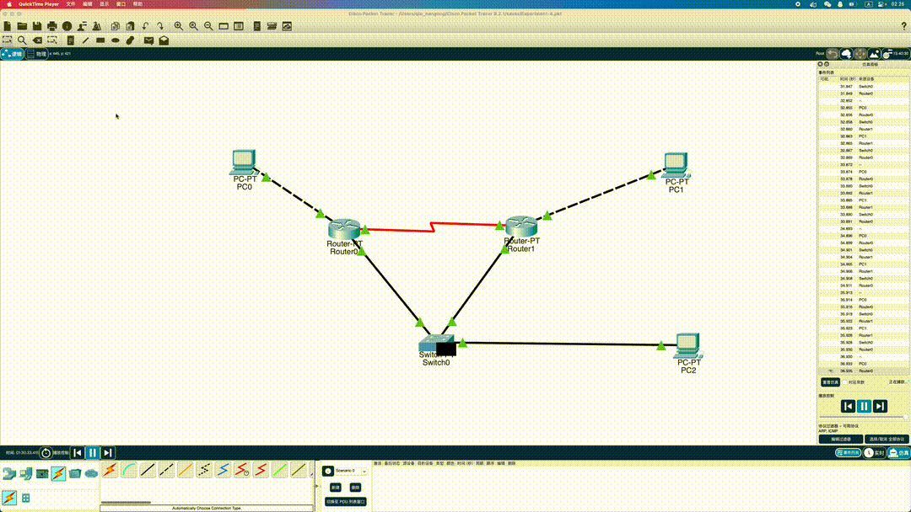

# 静态路由实验

院系：计算机学院

班级：计科五班

组长：刘森元

|   学号   |  学生  |
| :------: | :----: |
| 21307289 | 刘森元 |
| 21307355 | 黄梓宏 |
| 21307357 | 刘思昊 |

## 实验题目

静态路由实验

## 实验目的

掌握静态路由的配置和使用方法，熟悉交换机端口镜像的方法以及如何用于监视端口

## 实验内容

1. 阅读教材 P190-192 关于端口镜像的内容
2. 阅读教材 P233 实例 7-1
3. 阅读教材 P29，熟悉 Packet Tracer 使用实例
4. 完成教材 P273 习题 15

## 实验记录

首先根据实验教程上的拓扑图进行网络配置


在 Packet Tracer 中有


对于各个设备进行 ip 配置，使用如下命令

```
Router> enable 15
Router# config
Router(config)# interface GigabitEthernet [port]
Router(config-if)# ip address [ip] [mask]
```

对于各个设备，可以查看到 ip 配置情况

*PC0*

```cmd
C:\>ipconfig

FastEthernet0 Connection:(default port)

   Connection-specific DNS Suffix..: 
   Link-local IPv6 Address.........: FE80::20A:41FF:FE88:7E5D
   IPv6 Address....................: ::
   IPv4 Address....................: 192.168.1.11
   Subnet Mask.....................: 255.255.255.0
   Default Gateway.................: ::
                                     192.168.1.1
```

*PC1*

```cmd
C:\>ipconfig

FastEthernet0 Connection:(default port)

   Connection-specific DNS Suffix..: 
   Link-local IPv6 Address.........: FE80::202:17FF:FEEE:CE8C
   IPv6 Address....................: ::
   IPv4 Address....................: 192.168.3.22
   Subnet Mask.....................: 255.255.255.0
   Default Gateway.................: ::
                                     192.168.3.2
```

*PC2*

```cmd
C:\>ipconfig

FastEthernet0 Connection:(default port)

   Connection-specific DNS Suffix..: 
   Link-local IPv6 Address.........: FE80::204:9AFF:FE22:6D0D
   IPv6 Address....................: ::
   IPv4 Address....................: 192.168.6.22
   Subnet Mask.....................: 255.255.255.0
   Default Gateway.................: ::
                                     0.0.0.0
```

*Router0*

```
Router#show ip interface brief 
Interface              IP-Address      OK? Method Status                Protocol 
FastEthernet0/0        192.168.6.1     YES manual up                    up 
FastEthernet1/0        192.168.1.1     YES manual up                    up 
Serial2/0              192.168.2.1     YES manual up                    up 
Serial3/0              unassigned      YES unset  administratively down down 
FastEthernet4/0        unassigned      YES unset  administratively down down 
FastEthernet5/0        unassigned      YES unset  administratively down down
```

*Router1*

```
Router#show ip interface brief 
Interface              IP-Address      OK? Method Status                Protocol 
FastEthernet0/0        192.168.6.2     YES manual up                    up 
FastEthernet1/0        192.168.3.2     YES manual up                    up 
Serial2/0              192.168.2.2     YES manual up                    up 
Serial3/0              unassigned      YES unset  administratively down down 
FastEthernet4/0        unassigned      YES unset  administratively down down 
FastEthernet5/0        unassigned      YES unset  administratively down down
```

### 1) 记录两台路由器的路由表

*Router0*

```
Router>show ip route
Codes: C - connected, S - static, I - IGRP, R - RIP, M - mobile, B - BGP
       D - EIGRP, EX - EIGRP external, O - OSPF, IA - OSPF inter area
       N1 - OSPF NSSA external type 1, N2 - OSPF NSSA external type 2
       E1 - OSPF external type 1, E2 - OSPF external type 2, E - EGP
       i - IS-IS, L1 - IS-IS level-1, L2 - IS-IS level-2, ia - IS-IS inter area
       * - candidate default, U - per-user static route, o - ODR
       P - periodic downloaded static route

Gateway of last resort is not set

C    192.168.1.0/24 is directly connected, FastEthernet1/0
C    192.168.2.0/24 is directly connected, Serial2/0
S    192.168.3.0/24 [1/0] via 192.168.6.2
C    192.168.6.0/24 is directly connected, FastEthernet0/0
```

*Router1*

```
Router>show ip route
Codes: C - connected, S - static, I - IGRP, R - RIP, M - mobile, B - BGP
       D - EIGRP, EX - EIGRP external, O - OSPF, IA - OSPF inter area
       N1 - OSPF NSSA external type 1, N2 - OSPF NSSA external type 2
       E1 - OSPF external type 1, E2 - OSPF external type 2, E - EGP
       i - IS-IS, L1 - IS-IS level-1, L2 - IS-IS level-2, ia - IS-IS inter area
       * - candidate default, U - per-user static route, o - ODR
       P - periodic downloaded static route

Gateway of last resort is not set

S    192.168.1.0/24 [1/0] via 192.168.6.1
C    192.168.2.0/24 is directly connected, Serial2/0
C    192.168.3.0/24 is directly connected, FastEthernet1/0
C    192.168.6.0/24 is directly connected, FastEthernet0/0
```

### 2) 用 PC0 ping PC1，记录交换机的 MAC 地址表

*PC0*

```
C:\>ping 192.168.3.22

Pinging 192.168.3.22 with 32 bytes of data:

Reply from 192.168.3.22: bytes=32 time<1ms TTL=126
Reply from 192.168.3.22: bytes=32 time<1ms TTL=126
Reply from 192.168.3.22: bytes=32 time<1ms TTL=126
Reply from 192.168.3.22: bytes=32 time<1ms TTL=126

Ping statistics for 192.168.3.22:
    Packets: Sent = 4, Received = 4, Lost = 0 (0% loss),
Approximate round trip times in milli-seconds:
    Minimum = 0ms, Maximum = 0ms, Average = 0ms
```

可见路由已成功配置

*Switch*

```
Switch#show mac address-table 
          Mac Address Table
-------------------------------------------

Vlan    Mac Address       Type        Ports
----    -----------       --------    -----

   1    0005.5e6c.0551    DYNAMIC     Fa1/1
   1    00e0.a3a5.b8ed    DYNAMIC     Fa0/1
```

其对应 MAC 地址分别为 Router0 和 Router1，证明数据包从 Switch 经过

### 3) 清除 MAC 地址表，启动 Wireshark 捕获，用 PC0 ping PC1，查看 PC3 是否可以捕获到 ARP 包、Echo 请求包和 Echo 相应包。如果有则对捕获的包截屏。查看并记录（截屏） PC0 的 ARP 缓冲区。最后，对结果进行分析。

根据 Packet Tracer 的模拟，显然 PC3 不能捕获到任何包，因为 ping 的数据路径为

PC0 -> Router0 -> Switch -> Router1 -> PC1


### 4) 重新启动Wiresharrk捕获，用PC1 ping PC0，查看是否可以捕获到 ARP 包、Echo 请求包和 Echo 响应包。如果有则对捕获的包截屏。查看并记录（截屏）PC0 的 ARP 缓冲区。最后，对结果进行分析。

与 3) 同理，显然 PC3 不能捕获到任何包，因为 ping 的数据路径为

PC0 -> Router0 -> Switch -> Router1 -> PC1



### 5) 利用 Packet Tracer 数据包的 Flash 动画功能，在模拟模式下，展示 PC0 与 PC1 间的数据包流动情况


### 6) 把交换机的端口 F1/1 镜像到端口 F2/1，再用 PC0 ping PC1。查看 PC3 是否可以捕获到 ARP 包、Echo 请求包和 Echo 响应包，如果可以捕捉到，则记录结果（截屏）。查看并记录此时交换机的 MAC 地址表。对结果进行解释说明。


可见数据包在进行镜像后被分发到 PC2，故 PC2 能够捕获到包

此时的交换机 MAC 地址表为

*Switch*

```
Switch#show mac address-table
          Mac Address Table
-------------------------------------------

Vlan    Mac Address       Type        Ports
----    -----------       --------    -----

   1    0005.5e6c.0551    DYNAMIC     Fa1/1
   1    00e0.a3a5.b8ed    DYNAMIC     Fa0/1
```

由于其仅进行镜像转发，无需与 PC2 建立连接，故仅有 Router0/1 的 MAC 地址

### 7) 将 5) 重做一次

**详见 6)**


## 自评

|   学号   |  学生  | 自评分 |
| :------: | :----: | :----: |
| 21307289 | 刘森元 |   96   |
| 21307355 | 黄梓宏 |   93   |
| 21307357 | 刘思昊 |   92   |

