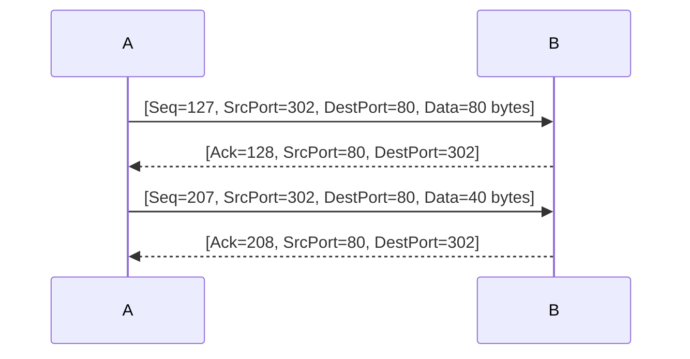

# Homework-2

*21307289 刘森元*

## Prob. 1

这些 8 比特字节和的反码为 
$$
\begin{align}
&\quad\text{inv}(0101 0011 + 0110 0110 + 0111 0100)\\
=&\quad\text{inv}(1010 1101)\\
=&\quad01010010
\end{align}
$$
- 检验和的目的是用于检测传输过程中的差错。使用反码可以增加检测差错的能力。如果直接使用和，可能会导致一些差错无法被检测到。   

- 使用反码方案，接收方可以通过将接收到的数据和检验和再次相加，如果结果中有任何一位为1，则表示存在差错。
- 尽管使用反码可以检测出大部分差错，但对于1比特的差错或者2比特的差错，仍然有可能无法被检测到。这是因为反码方案并不是绝对完美的，仍然存在一定的差错检测能力有限性。   

## Prob. 2

根据公式可写出计算代码

```python
def calculate_timeout_interval(sample_rtt):
    global estimated_rtt, dev_rtt

    # 计算EstimatedRTT
    estimated_rtt = (1 - alpha) * estimated_rtt + alpha * sample_rtt

    # 计算DevRTT
    dev_rtt = (1 - beta) * dev_rtt + beta * abs(sample_rtt - estimated_rtt)

    # 计算TimeoutInterval
    timeout_interval = estimated_rtt + 4 * dev_rtt

    return timeout_interval
```

代入数据计算有结果

```
Timeout Interval for Sample 1: 135.0
Timeout Interval for Sample 2: 134.375
Timeout Interval for Sample 3: 153.203125
Timeout Interval for Sample 4: 149.833984375
Timeout Interval for Sample 5: 141.41357421875
```

完整代码见文末

## Prob. 3

根据题目描述，我们可以使用以下公式来计算窗口长度（W）以实现超过 90% 的信道利用率：

$$
利用率 = \dfrac{窗口长度 \times 分组长度}{RTT \times 发送速率}
$$
我们需要找到一个窗口长度（W），使得利用率超过 90%。

根据题目给出的信息：
$$
RTT = 30毫秒 = 0.03秒\\
发送速率 R = 1Gbps = 10^9 bps\\
分组长度 = 1500字节\\
利用率 > 0.9
$$
将这些值代入公式，我们可以得到：

$$
0.9 < (W * 1500) / (0.03 * 10^9)
$$
通过简单的计算，我们可以解出窗口长度（W）：

$$
W > (0.9 * 0.03 * 10^9) / 1500\\
W > 1800
$$
因此，当窗口长度设置为大于 1800 时，该信道的利用率才能超过90%。

## Prob. 4

a. 第二个报文段中的序号是207，源端口号是302，目的地端口号是80。

b. 如果第一个报文段在第二个报文段之前到达，那么在第一个到达报文段的确认中，确认号是207，源端口号是80，目的地端口号是302。

c. 如果第二个报文段在第一个报文段之前到达，那么在第一个到达报文段的确认中，确认号是81。

d. 

## Prob. 5

a. 对于GBN（Go-Back-N）协议：
- 主机A总共发送了5个报文段，序号为1、2、3、4、5。
- 主机B总共发送了3个ACK，序号为1、2、3。

对于SR（Selective Repeat）协议：
- 主机A总共发送了5个报文段，序号为1、2、3、4、5。
- 主机B总共发送了5个ACK，序号为1、2、3、4、5。

对于TCP（无延时的ACK）协议：
- 主机A总共发送了5个报文段，序号为1、2、3、4、5。
- 主机B总共发送了5个ACK，序号为1、2、3、4、5。

b. 

如果超时值比5个往返时延（RTT）长得多，那么GBN、SR和TCP协议都能成功地在最短的时间间隔内交付所有5个数据报文段。

因为超时值足够长，可以确保在报文段丢失的情况下，发送方能够重新发送丢失的报文段，并且接收方能够正确接收和确认这些报文段。

故这三个协议的交付时间间隔是相同的。

## Prob. 6

a. TCP慢启动运行时的时间间隔：

在图中，拥塞窗口长度从1开始，每个传输轮回翻倍增长，直到拥塞窗口长度达到阈值。因此，TCP慢启动运行时的时间间隔是从第1个传输轮回开始，一直到拥塞窗口长度达到阈值。

b. TCP拥塞避免运行时的时间间隔：

在图中，拥塞避免阶段发生在拥塞窗口长度达到阈值之后。在拥塞避免阶段，拥塞窗口长度以较慢的速率线性增长。因此，TCP拥塞避免运行时的时间间隔是从拥塞窗口长度达到阈值开始，一直到发生拥塞事件（如超时或冗余ACK）。

c. 在第16个传输轮回之后，报文段的丢失是根据3个冗余ACK还是根据超时检测出来的？

根据给出的拥塞窗口长度图，在第16个传输轮回之后，拥塞窗口长度增加到了32。如果发生报文段丢失，TCP Reno协议会使用快速重传机制，根据3个冗余ACK来检测报文段的丢失。

d. 在第22个传输轮回之后，报文段的丢失是根据3个冗余ACK还是根据超时检测出来的？

根据给出的拥塞窗口长度图，在第22个传输轮回之后，拥塞窗口长度增加到了29。如果发生报文段丢失，TCP Reno协议会使用超时检测机制来检测报文段的丢失。

e. 在第1个传输轮回里，ssthresh的初始值设置为多少？

在第1个传输轮回里，ssthresh的初始值通常设置为一个较大的值，例如65535，表示不限制慢启动阶段的拥塞窗口大小。

f. 在第18个传输轮回里，ssthresh的值设置为多少？

根据给出的拥塞窗口长度图，在第18个传输轮回里，ssthresh的值应该是16，因为这是拥塞避免阶段开始时的拥塞窗口长度。

g. 在第24个传输轮回里，ssthresh的值设置为多少？

根据给出的拥塞窗口长度图，在第24个传输轮回里，ssthresh的值应该是8，因为这是拥塞避免阶段开始时的拥塞窗口长度。

h. 在哪个传输轮回内发送第70个报文段？

根据给出的拥塞窗口长度图，我们可以看到第70个报文段发送在第26个传输轮回内。

i. 假定在第26个传输轮回后，通过收到3个冗余ACK检测出有分组丢失，拥塞的窗口长度和ssthresh的值应当是多少？

根据TCP Reno的拥塞控制算法，在收到3个冗余ACK后，拥塞窗口长度将减半，ssthresh的值将设置为当前窗口长度的一半。因此，在第26个传输轮回后，拥塞窗口长度应该是4，ssthresh的值应该是16。

j. 假定使用TCP Tahoe（而不是TCP Reno），并假定在第16个传输轮回收到3个冗余ACK。在第19个传输轮回，ssthresh和拥塞窗口长度是什么？

TCP Tahoe协议在收到3个冗余ACK后，会进行快速重传并将拥塞窗口长度设置为1。因此，在第19个传输轮回，ssthresh的值应该是16（因为这是拥塞避免阶段开始时的拥塞窗口长度），拥塞窗口长度应该是1。

k. 再次假设使用TCP Tahoe，在第22个传输轮回有一个超时事件。从第17个传输轮回到第22个传输轮回（包括这两个传输轮回），一共发送了多少分组？

在TCP Tahoe中，当发生超时事件时，拥塞窗口长度将被设置为1，并进行慢启动。因此，从第17个传输轮回到第22个传输轮回（包括这两个传输轮回），一共发送了6个分组。

## Prob. 7

a. 这条TCP连接能够取得的最大窗口长度（以报文段计）取决于两个因素：拥塞窗口大小和接收方窗口大小。假设接收方的接收缓存比拥塞窗口要大得多，那么窗口长度将受限于拥塞窗口大小。由于题目中没有提供拥塞窗口的具体大小，无法确定最大窗口长度。

b. 平均窗口长度（以报文段计）可以通过计算拥塞窗口的平均值得到。由于题目中没有提供具体的拥塞窗口变化情况，无法确定平均窗口长度。平均吞吐量（以bps计）可以通过拥塞窗口长度和链路带宽计算得到。假设拥塞窗口长度为W个报文段，链路带宽为10Mbps（即10^7 bps），平均吞吐量为W * 1500 * 8 bps。

c. 当TCP连接从丢包恢复后，再次达到最大窗口所需的时间取决于拥塞控制算法和网络条件。在TCP Reno中，当发生拥塞时，拥塞窗口将被减半，并且慢启动阈值（ssthresh）将被设置为当前窗口的一半。然后，TCP连接将进入拥塞避免阶段，其中拥塞窗口以线性增加的速率增长。恢复到最大窗口所需的时间取决于拥塞避免阶段的增长速率和网络条件。由于题目中没有提供具体的拥塞控制算法和网络条件，无法确定恢复到最大窗口所需的时间。

## Prob-2代码

```python
alpha = 0.125
beta = 0.25
estimated_rtt = 100  # 初始EstimatedRTT
dev_rtt = 5  # 初始DevRTT


def calculate_timeout_interval(sample_rtt):
    global estimated_rtt, dev_rtt

    # 计算EstimatedRTT
    estimated_rtt = (1 - alpha) * estimated_rtt + alpha * sample_rtt

    # 计算DevRTT
    dev_rtt = (1 - beta) * dev_rtt + beta * abs(sample_rtt - estimated_rtt)

    # 计算TimeoutInterval
    timeout_interval = estimated_rtt + 4 * dev_rtt

    return timeout_interval


# 样本1
sample_rtt_1 = 120
timeout_interval_1 = calculate_timeout_interval(sample_rtt_1)
print("Timeout Interval for Sample 1:", timeout_interval_1)

# 样本2
sample_rtt_2 = 110
timeout_interval_2 = calculate_timeout_interval(sample_rtt_2)
print("Timeout Interval for Sample 2:", timeout_interval_2)

# 样本3
sample_rtt_3 = 130
timeout_interval_3 = calculate_timeout_interval(sample_rtt_3)
print("Timeout Interval for Sample 3:", timeout_interval_3)

# 样本4
sample_rtt_4 = 115
timeout_interval_4 = calculate_timeout_interval(sample_rtt_4)
print("Timeout Interval for Sample 4:", timeout_interval_4)

# 样本5
sample_rtt_5 = 105
timeout_interval_5 = calculate_timeout_interval(sample_rtt_5)
print("Timeout Interval for Sample 5:", timeout_interval_5)
```

